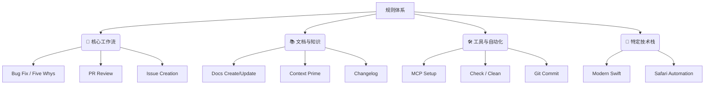

# Trae 规则创建启发与源码分析报告

## 一、 Trae 规则创建的核心启发 (Inspirations)

通过分析 `agent-rules-main` 项目，我们可以为 Trae 的 Agent 规则创建总结出以下核心启发：

1.  **场景化与角色化 (Context & Persona)**
    *   不要试图写一个 "万能助手"。
    *   **启发**: 创建 "Bug 修复专家"、"架构师"、"文档专员" 等特定角色的规则文件。

2.  **流程显性化 (Process Explicitization)**
    *   不要只告诉 AI "做什么"，要告诉它 "先做什么，再做什么，最后检查什么"。
    *   **启发**: 定义 Step 1 -> Step 2 -> Step 3 的严格步骤。

3.  **模板化输出 (Templated Output)**
    *   如果你希望 AI 的回答格式统一，直接在规则里提供 Markdown 模板。
    *   **启发**: 强制要求 AI 填空，而不是自由发挥。

4.  **元规则管理 (Meta-Rules)**
    *   使用规则来管理规则。
    *   **启发**: 创建 "Trae 规则专家" 来辅助编写 `.mdc` 文件。

---

## 二、 源码文件分类分析 (Categorized Analysis)

为了更清晰地理解，我们将 20+ 个规则文件按功能进行了分类：

### 🧩 1. 核心工作流 (Core Workflows)

这些规则定义了软件工程中最关键的任务流程。

#### [根因分析 (five.mdc)](project-rules/five.mdc)
- **核心思想**: 深度思考工具，应用 "5 Whys" 分析法。
- **Prompt 技巧**:
  - **思维强制**: 强制 AI 连续追问 5 次 "为什么"。
  - **格式示范**: 提供具体的 Example (App crash -> ... -> Requirements gathering failed)。

#### [PR 审查专家 (pr-review.mdc)](project-rules/pr-review.mdc)
- **核心思想**: 多角色扮演 (Role Playing) 进行全方位审查。
- **Prompt 技巧**:
  - **角色列表**: 定义 PM, Developer, QA, Security, DevOps, Designer 六个视角。
  - **结构化输出**: 即使是一个人审查，也要模拟这六个角色的视角输出报告。

#### [GitHub Issue 创建 (github-issue-creation.mdc)](global-rules/github-issue-creation.mdc)
- **核心思想**: 复杂的 Agentic 工作流 (思考 -> 计划 -> 执行)。
- **Prompt 技巧**:
  - **思维链 (CoT)**: 强制 AI 先 Research，再 Plan，最后 Create。
  - **XML 结构**: 使用 `<plan>` 和 `<github_issue>` 标签包裹输出。

---

### 📚 2. 文档与知识管理 (Docs & Knowledge)

这些规则确保文档与代码同步，并维护项目知识库。

#### [文档创建/更新 (create/update-docs.mdc)](project-rules/create-docs.mdc)
- **核心思想**: 文档即代码 (Docs as Code)。
- **Prompt 技巧**:
  - **触发器**: 代码变更时，必须检查文档。
  - **自动化索引**: 创建文档后，自动更新索引文件。

#### [上下文增强 (context-prime.mdc)](project-rules/context-prime.mdc)
- **核心思想**: 预加载项目核心知识。
- **Prompt 技巧**:
  - **显式读取**: 强制执行 `read_file` 操作，确保上下文进入 AI 内存。

#### [变更日志管理 (add-to-changelog.mdc)](project-rules/add-to-changelog.mdc)
- **核心思想**: 自动化维护 Changelog。
- **Prompt 技巧**:
  - **格式规范**: 规定日期格式 `[YYYY-MM-DD]` 和条目分类。

---

### 🛠️ 3. 工具与自动化 (Tools & Automation)

这些规则简化了日常的琐碎操作。

#### [Git 提交规范 (commit.mdc)](project-rules/commit.mdc)
- **核心思想**: 遵循 Conventional Commits 规范。
- **Prompt 技巧**:
  - **分步引导**: 思考 -> 暂存 -> 提交。
  - **类型枚举**: 明确列出 `feat`, `fix`, `docs` 等允许的类型。

#### [MCP 配置指南 (mcp-*.mdc)](global-rules/mcp-peekaboo-setup.mdc)
- **核心思想**: 复杂工具的 "安装向导"。
- **Prompt 技巧**:
  - **配置生成**: 直接给出可复制的 JSON 配置。
  - **故障排查**: 预判权限问题并给出解法。

#### [项目清理与检查 (clean/check.mdc)](project-rules/check.mdc)
- **核心思想**: 将复杂 Shell 命令封装为自然语言指令。
- **Prompt 技巧**:
  - **别名机制**: 用户输入 "check" 实际执行 `./test.sh`。

---

### 📱 4. 特定技术栈 (Tech Stack Specifics)

针对特定语言或框架的最佳实践。

#### [现代 Swift 开发规范 (modern-swift.mdc)](project-rules/modern-swift.mdc)
- **核心思想**: 强制使用最新技术栈。
- **Prompt 技巧**:
  - **版本限定**: 明确针对 Swift 5.9+。
  - **模式推荐**: 强制使用 `@Observable` 而非 `ObservableObject`。

#### [自动化测试-Safari (safari-automation.mdc)](project-rules/safari-automation.mdc)
- **核心思想**: 跨语言嵌入 (JavaScript in AppleScript)。
- **Prompt 技巧**:
  - **Shadow DOM**: 专门处理 Shadow DOM 的 JS 注入代码。

---

## 三、 下一步建议

现在你已经了解了这些规则背后的逻辑，请阅读 **[Trae 高阶 Prompt 技巧](./TRAE_ADVANCED_TECHNIQUES.md)**，学习如何将这些技巧应用到你自己的规则编写中。
