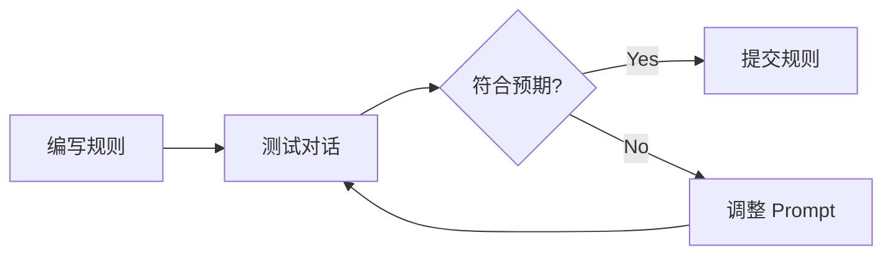

# Trae 高阶 Prompt 技巧与复用指南

本文档提炼自 `agent-rules-main` 项目，总结了可直接应用于 Trae 规则（.mdc/.md）编写的高阶技巧。

> **前置阅读建议**: 如果你想了解这些技巧的来源和具体案例，请先阅读 **[源码剖析与启发](./RULE_ANALYSIS_AND_INSPIRATION.md)**。

---

## 一、 核心技巧概览

| 技巧名称 | 核心逻辑 | 适用场景 |
| :--- | :--- | :--- |
| **角色沉浸 (Role Immersion)** | 定义具体的职位、视角和职责清单 | 复杂任务（如 Code Review、架构设计） |
| **思维链强制 (CoT Enforcement)** | 强制 AI 在行动前先思考、调研、计划 | 容易出错或需要统筹的任务（如创建 Issue、重构） |
| **流程显性化 (SOP)** | Step 1 -> Step 2 -> Step 3 | 必须按顺序执行的任务（如 Bug 修复、发布流程） |
| **模板化输出 (Output Templating)** | 提供 Markdown 骨架，要求填空 | 需要统一格式的文档生成、报告输出 |
| **防御性提示 (Defensive Prompting)** | 预判错误并给出“避坑指南” | 容易产生幻觉或语法错误的代码生成 |

---

## 二、 技巧详解与代码片段 (可以直接 Copy)

### 1. 角色沉浸 (Role Immersion)
**原理**: 不仅仅说 "你是 AI"，而是赋予它具体的 Persona，甚至让它同时扮演多个角色。

**代码片段**:
```markdown
# Role: 资深代码审查委员会 (Senior Code Reviewer Board)

你是一个由多名专家组成的虚拟审查委员会，成员包括：
1. **安全专家 (Security Engineer)**: 关注注入攻击、PII 泄漏和鉴权问题。
2. **性能专家 (Performance Expert)**: 关注 N+1 查询、内存泄漏和包体积。
3. **交互设计师 (UX Designer)**: 关注无障碍性 (a11y) 和设计一致性。

## Interaction (交互方式)
即使你只是一个 AI，你必须按照上述角色的视角，分章节输出你的审查意见。
```

### 2. 思维链强制 (Chain of Thought)
**原理**: 模仿 `global-rules/github-issue-creation.mdc`，强制 AI 显式展示思考过程。

**代码片段**:
```markdown
# Workflow (工作流)

在编写任何代码或文本之前，你**必须**执行以下步骤：

1.  **调研 (Research)**: 使用 `read_file` 读取相关文件，理解上下文。
2.  **思考 (Think)**: 分析用户请求。有哪些边界情况？需要哪些依赖？
3.  **计划 (Plan)**: 在 <plan> 标签中输出计划。
    <plan>
    - [ ] Step 1: ...
    - [ ] Step 2: ...
    </plan>
4.  **执行 (Execute)**: 只有在计划展示之后，才开始执行代码编写。
```

### 3. 流程显性化 (Standard Operating Procedure)
**原理**: 将最佳实践固化为 SOP，防止 AI 跳步。

**代码片段**:
```markdown
# Bug Fix SOP (Bug 修复标准流程)

当修复 Bug 时，严格遵循以下顺序：

1.  **重现 (Reproduce)**: 创建一个能重现错误的脚本或测试用例。
2.  **验证失败 (Verify Failure)**: 运行测试，确认它确实会失败。
3.  **分析 (Analyze)**: 使用 "5 Whys" 分析法找到根本原因。
4.  **修复 (Fix)**: 应用修复代码。
5.  **验证成功 (Verify Success)**: 再次运行测试，确认它通过。
```

### 4. 模板化输出 (Templated Output)
**原理**: 减少 AI "自由发挥" 导致的格式混乱。

**代码片段**:
```markdown
# Output Format (输出格式)

你必须严格遵循以下 Markdown 模板进行回复：

## 深度分析 (Analysis)
[在此处填写分析内容]

## 提议变更 (Proposed Changes)
- 文件: `path/to/file`
- 变更: [变更描述]

## 验证计划 (Verification Plan)
- [ ] 待运行命令: `...`
- [ ] 预期输出: `...`
```

### 5. 防御性提示 (Defensive Prompting)
**原理**: 预先禁止已知的错误模式。

**代码片段**:
```markdown
# Constraints & Anti-Patterns (约束与反模式)

- **禁止 (NEVER)** 在 Swift 5.9+ 代码中使用 `ObservableObject`；请使用 `@Observable` 宏。
- **禁止 (NEVER)** 留下占位符注释，如 `// ... rest of code`。必须编写完整代码。
- **避免 (AVOID)** 使用 `git clean` 而不先列出要删除的文件。
```

---

## 三、 规则调试与验证 (Debugging & Verification)

编写规则只是第一步，你需要验证它是否生效。

### 1. 验证方法
*   **显式触发**: 在对话中直接说 "Run the Bug Fix SOP"。
*   **检查输出**: 看 AI 是否输出了 `<plan>` 标签（如果你用了 CoT 技巧），或者是否遵循了模板。
*   **边缘测试**: 故意给出一个模糊的指令，看 AI 是否会通过 "Research" 步骤来澄清，还是直接瞎猜。

### 2. 迭代循环


---

## 四、 组合应用示例

将以上技巧组合，可以创建一个 **"架构师级"** 的规则文件。

**文件名**: `architect-design.mdc`

```markdown
---
description: 架构设计助手
globs: "design/*.md"
---

# Role: 系统架构师 (System Architect)

## Workflow (工作流)
1. **理解 (Understand)**: 阅读现有的设计文档。
2. **思考 (Think)**: 识别瓶颈和可扩展性问题。
3. **模板 (Template)**:
   使用以下结构输出设计：
   - **背景 (Context)**: ...
   - **决策 (Decision)**: ...
   - **后果 (Consequences)**: ...

## Constraints (约束)
- 图表必须使用 Mermaid 的 `TD` 或 `LR` 布局。
- 始终考虑 "Day 2 Operations" (日志、监控)。
```
